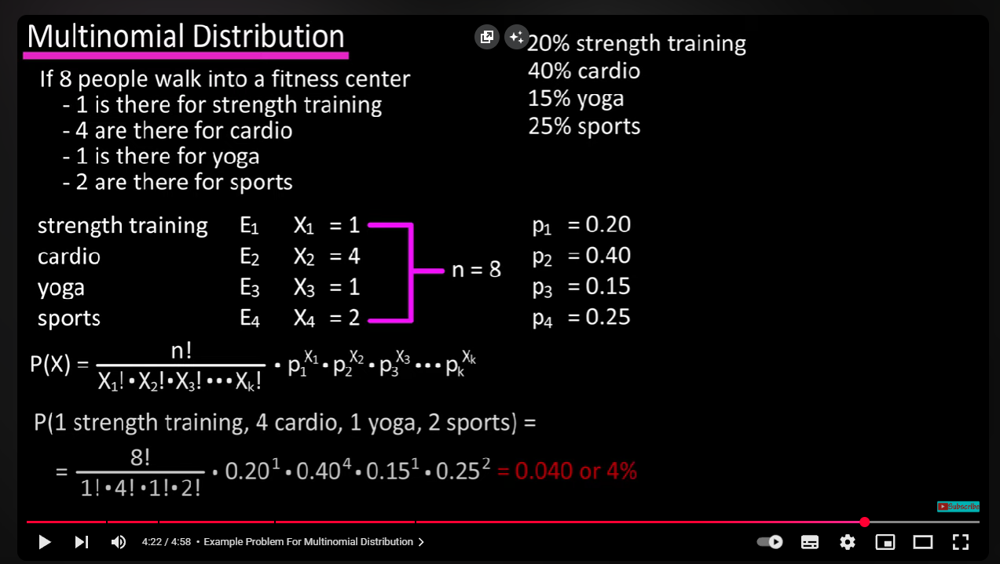
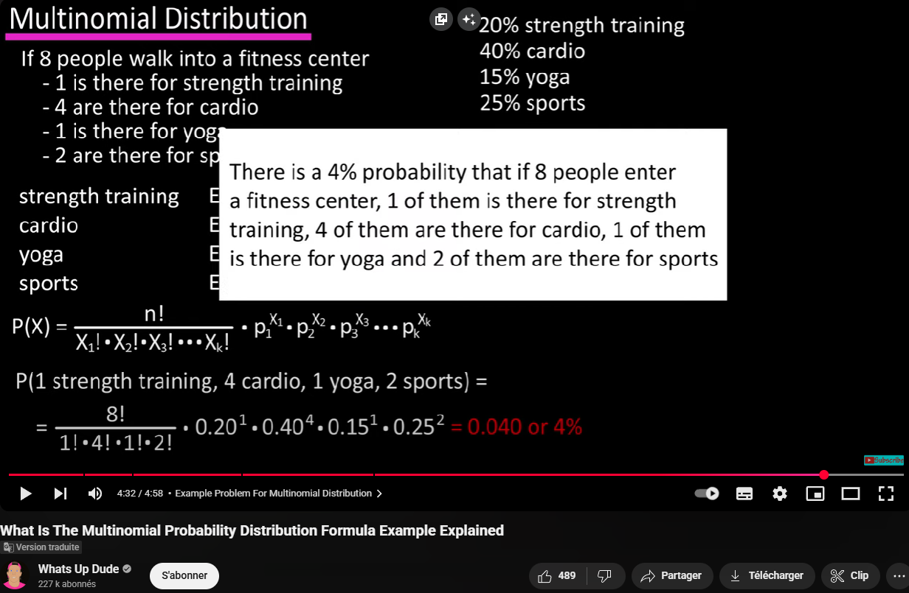

## Table des Matières
* [Résumé](#résumé)
* [Notions principales détaillées](#notions-principales-détaillées)
* [Références citées dans le document](#références-citées-dans-le-document)
* [Liens pour approfondir les notions](#liens-pour-approfondir-les-notions)
* [Conclusion](#conclusion)
* [Questions liées](#questions-liées)

## Résumé
Voici un résumé détaillé du document "A cyclic algorithm for maximum likelihood estimation using Schur complement" d’Assi N’Guessan et Issa Cherif Geraldo, avec explications des notions principales, références citées, et des liens vers les concepts pour approfondir.

Résumé du document
Ce travail propose un nouvel algorithme cyclique pour l’estimation du maximum de vraisemblance sous contraintes, utilisant le complément de Schur pour résoudre le problème d’optimisation. L’algorithme est conçu pour des situations où les paramètres inconnus peuvent être séparés en deux groupes, ce qui permet une résolution alternée (par blocs) et explicite des équations d’estimation, évitant ainsi le calcul coûteux de la matrice Hessienne habituellement requis dans les méthodes classiques comme Newton-Raphson ou BFGS.

Les auteurs démontrent que leur approche est plus rapide que les méthodes traditionnelles, notamment dans des cas pratiques de grande dimension ou de contraintes complexes, et l’appliquent à l’évaluation de politiques de sécurité routière à travers des simulations numériques.

## Notions principales détaillées
0. [Matrice symétrique définie positive](https://fr.wikipedia.org/wiki/Matrice_d%C3%A9finie_positive)

1. Maximum de vraisemblance (MLE)
Méthode statistique pour estimer les paramètres d’un modèle probabiliste en maximisant la probabilité d’observer les données recueillies.

Généralement, on maximise la log-vraisemblance sous contraintes (par exemple, la somme des probabilités de classes égale à 1).

[Voir la définition détaillée de la méthode du maximum de vraisemblance](https://fr.wikipedia.org/wiki/Maximum_de_vraisemblance)

2. Complément de Schur
Outil d’algèbre linéaire permettant de simplifier l’inversion de matrices partitionnées, crucial ici pour obtenir une solution explicite sans calculer la Hessienne entière.

[En savoir plus sur le complément de Schur](https://fr.wikipedia.org/wiki/Compl%C3%A9ment_de_Schur)
[Schur Complement](https://www.youtube.com/watch?v=3d_-klrMZLw&t=19s)

3. Optimisation sous contraintes
Problème où l’on maximise (ou minimise) une fonction objectif sous des contraintes d’égalité ou d’inégalité sur les paramètres.

Ici, les contraintes sont linéaires (par exemple, somme des probabilités égale à 1) et de bornes (chaque probabilité entre 0 et 1).

4. Méthodes classiques comparées
Newton-Raphson : nécessite le calcul de la Hessienne, coûteux en grande dimension.

Quasi-Newton (BFGS) : approche la Hessienne via le gradient, plus efficace mais encore coûteuse.

Nelder-Mead : méthode sans dérivées, adaptée à certains cas mais moins performante en présence de contraintes complexes.

[Voir la méthode de Newton-Raphson](https://fr.wikipedia.org/wiki/M%C3%A9thode_de_Newton)

[Voir la méthode BFGS](https://en.wikipedia.org/wiki/Broyden%E2%80%93Fletcher%E2%80%93Goldfarb%E2%80%93Shanno_algorithm)

[Voir la méthode Nelder-Mead](https://fr.wikipedia.org/wiki/M%C3%A9thode_de_Nelder-Mead)

5. Algorithme cyclique proposé
Partitionne les paramètres en deux groupes, alternant leur estimation (block coordinate descent).

Utilise le complément de Schur pour obtenir la solution du sous-système linéaire à chaque étape, sans recourir à la Hessienne.

Converge plus rapidement dans les simulations, notamment pour des données de type multinomiale et des applications en sécurité routière.

6. Cas d’application : sécurité routière
L’algorithme est appliqué à la modélisation de données d’accidents de la route, pour estimer l’effet moyen d’une mesure de sécurité et les risques associés.

Les simulations montrent une meilleure performance par rapport aux méthodes classiques, en particulier en termes de vitesse de convergence et de robustesse aux choix initiaux.

7. Algorithme cyclique

L'algorithme cyclique proposé par N’Guessan et Geraldo fonctionne probablement de la manière suivante :

- Décomposition : Les paramètres inconnus du modèle de maximum de vraisemblance sont divisés en (au moins) deux groupes (blocs).

- Cycle d'estimation :

    * Étape A : Estimer le premier groupe de paramètres en considérant le second groupe comme fixe (en utilisant leurs valeurs actuelles). Le complément de Schur est probablement utilisé ici pour simplifier cette étape.
    * Étape B : Estimer le second groupe de paramètres en considérant le premier groupe comme fixe (en utilisant les valeurs nouvellement mises à jour de l'étape A).

- Répétition : Répéter les étapes A et B (le cycle) jusqu'à ce que les estimations des paramètres convergent (ne changent plus significativement).

8. Loi ou distribution multinomiale (cas particulier: loi binomiale)
[What Is The Multinomial Probability Distribution Formula Example Explained](https://www.youtube.com/watch?v=BZxCIkSkMgo)

[The Binomial Distribution and the Multinomial Distribution](https://www.youtube.com/watch?v=UXB9eeMZfwo)

9. Gradient
[Comment calculer le gradient d'une fonction](https://www.youtube.com/watch?v=JiM2iR8gN4M)

10. Newton-Raphson
[Newton-Raphson Formula And Derivation | Part 1 of 2](https://www.youtube.com/watch?v=YSl37OYMLFw)

## Références citées dans le document
 Méthode du maximum de vraisemblance : [1–3] dans le document (références internes à l’article)

 Revue complète des méthodes d’optimisation classiques

[5–8] Description de l’algorithme BFGS

 Méthode de Nelder–Mead

[10–12] Adaptations des méthodes classiques au maximum de vraisemblance sous contraintes

[13],orithmes MM (Minorization–Maximization)

Travaux antérieurs des auteurs sur la résolution par systèmes non linéaires

[17–19] Propriétés du complément de Schur

## Liens pour approfondir les notions
| Notion                     | Lien pour approfondir                                                                                                |
|----------------------------|----------------------------------------------------------------------------------------------------------------------|
| Maximum de vraisemblance   | [https://fr.wikipedia.org/wiki/Maximum_de_vraisemblance](https://fr.wikipedia.org/wiki/Maximum_de_vraisemblance)     |
| Complément de Schur        | [https://fr.wikipedia.org/wiki/Compl%C3%A9ment_de_Schur](https://fr.wikipedia.org/wiki/Compl%C3%A9ment_de_Schur)       |
| Optimisation sous contraintes | [https://fr.wikipedia.org/wiki/Programmation_math%C3%A9matique](https://fr.wikipedia.org/wiki/Programmation_math%C3%A9matique) |
| Méthode de Newton-Raphson  | [https://fr.wikipedia.org/wiki/M%C3%A9thode_de_Newton](https://fr.wikipedia.org/wiki/M%C3%A9thode_de_Newton)           |
| Méthode BFGS               | [https://en.wikipedia.org/wiki/Broyden%E2%80%93Fletcher%E2%80%93Goldfarb%E2%80%93Shanno_algorithm](https://en.wikipedia.org/wiki/Broyden%E2%80%93Fletcher%E2%80%93Goldfarb%E2%80%93Shanno_algorithm) |
| Méthode Nelder-Mead        | [https://fr.wikipedia.org/wiki/M%C3%A9thode_de_Nelder-Mead](https://fr.wikipedia.org/wiki/M%C3%A9thode_de_Nelder-Mead)   |
| Algorithmes MM             | [https://en.wikipedia.org/wiki/Expectation%E2%80%93maximization_algorithm#Relation_to_MM_algorithms](https://en.wikipedia.org/wiki/Expectation%E2%80%93maximization_algorithm#Relation_to_MM_algorithms) |

## Conclusion
L’article propose une alternative efficace et explicite aux méthodes classiques d’estimation sous contraintes, en tirant parti du complément de Schur et d’une démarche cyclique. Cette approche est particulièrement adaptée aux problèmes de grande dimension et à contraintes complexes, comme illustré dans le domaine de la sécurité routière.

Pour toute question sur une notion spécifique, consulte les liens ci-dessus pour des explications détaillées.

## Questions liées
Quelles sont les notions clés du complément de Schur et leurs applications
Où puis-je trouver des ressources détaillées sur la décomposition en blocs de l'opérateur A
Comment le complément de Schur facilite la résolution de systèmes linéaires complexes
Quelles références académiques ou liens pour approfondir la théorie du complément de Schur
Existe-t-il des exemples concrets ou études de cas illustrant l'utilisation du complément de Schur